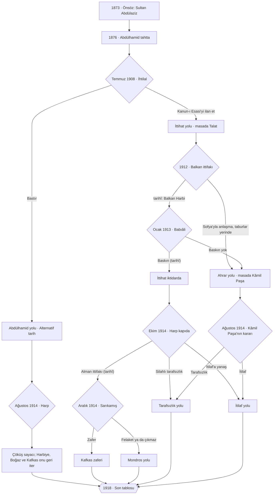

# GD 03 · Sonlar ve Yollar

Sekiz son, onlara giden yollar (yol × sonuç matrisi), yol ayrımları, kaldıraçlar ve bütün yazarların kullandığı bayrak kaydı. Geri: [[GD 00 Rehber]] · Kurallar: [[GD 02 Sistemler]] · Olaylar: [[GD 01 Olay Sıralaması]].

## Akış

## Son matrisi

Sonlar doğrusal değildir: oyun sonunda (ya da bir yolun son olayı `☠ karar` dediğinde) aşağıdaki tablo **yukarıdan aşağı** denenir, koşulu tutan ilk satır sondur. Son satırın koşulu yoktur. Koşullar yolu (bayrak), cephe dengelerini, illeri (`il:edirne = OS`) ve sayaçları okur. Bazı olaylar sonu doğrudan da koyar (`☠ son1`, `☠ son2`, `☠ son3`); o olayların koşulu tablodaki satırla aynıdır.

| Sıra | Son | Yol | Koşul (özet) | Tarih mi? |
|---|---|---|---|---|
| 10 | Payitahtta Rus Çizmesi (`son1`) | Abdülhamid | `cokus >= 100` | Alternatif tarih |
| 20 | Yıldız'ın Zaferi (`son_hamid_zafer`) | Abdülhamid | Kafkas zaferi ve Boğaz tutuldu | Alternatif tarih |
| 30 | Yıldız'da Mütareke (`son_hamid_mutareke`) | Abdülhamid | geri kalan her Abdülhamid oyunu | Alternatif tarih |
| 40 | Kafkas Zaferi (`son2`) | İttihat, Alman ittifakı | Sarıkamış zaferi, Kars–Ardahan–Batum | Alternatif tarih |
| 50 | Ahrar'ın Barışı (`son_ahrar`) | Ahrar | tarafsız kalındı ve Edirne elde (ya da Balkan Harbi hiç çıkmadı) | Alternatif tarih |
| 60 | İtilaf'la Bir Barış (`son_itilaf`) | İttihat ya da Ahrar | 1914'te İtilaf'a yanaşıldı | Alternatif tarih |
| 70 | Tarafsız İmparatorluk (`son_tarafsiz`) | İttihat ya da Ahrar | 1914'te harbe girilmedi | Alternatif tarih |
| 99 | Mondros'tan Samsun'a (`son3`) | İttihat, Alman ittifakı | geri kalan her şey | **tarihî** |

**Yollar:**
- **Abdülhamid yolu** (1908'de ihtilal bastırılır). Harp 1914'te ya da en geç 1915'te gelir. Kasadaki kitapların anlattığı çürüme (tatbikat yok, donanma Haliç'te, tüfekler depoda) `cokus` sayacını yürütür. Ama Abdülhamid de kazanabilir: Goltz'a serbestlik, manevralar ve Alman heyetiyle Harbiye 35'in üstünde tutulursa sayaç her yıl geriler (`k_hamid_ordu`). Kafkas cephesi dengede kalırsa `hamid_kafkas_zafer` gelir. Donanma Haliç'ten çıkmışsa `hamid_bogaz_tutuldu` gelir. Rusya 1917'de çözülünce `hamid_rus_ihtilali` sayacı büyük ölçüde siler.
- **İttihat yolu** (tarihî). Ekim 1914'teki `harp_kapida` üç yola ayrılır:
  - Souchon'a izin (tarihî): `karadeniz_baskini` → `⚑ittifak_harbi` → Sarıkamış ayrımı.
  - Silahlı tarafsızlık: `⚑tarafsiz_1914`.
  - İtilaf'a yanaşma: `⚑itilaf_yolu`.
  - Bu kararın dayanağı Yalman'dır: üç aylık silahlı tarafsızlıkta ılımlılar ile harp yanlılarının mücadelesi, Enver'in Rus sefirine şartlı teklifi ve Talat'ın "İstanbul Almanların silah tehdidi altında" sözü ([[Birinci Dünya Savaşı'nda Türkiye (Ahmet Emin Yalman)#p. 100|Yalman, p. 100]] · [[Birinci Dünya Savaşı'nda Türkiye (Ahmet Emin Yalman)#p. 101|p. 101]] · [[Birinci Dünya Savaşı'nda Türkiye (Ahmet Emin Yalman)#p. 106|p. 106]] · *Türk kaynağı*).
- **Ahrar yolu** (Alternatif tarih). İki yoldan gelinir:
  - Ocak 1913'te Babıâli basılmazsa (`baskin_karari`, Enver'i durdurabilmek gerekir).
  - Balkan Harbi hiç çıkmazsa (`balkan_esik`). O zaman Baskın'ın bahanesi olan Edirne de yoktur.
  - Masada Kâmil Paşa oturur, sonra Gazi Ahmed Muhtar Paşa. Prens Sabahaddin'in adem-i merkeziyet programı ve İngiltere'ye yakınlık bu yolun kaldıraçlarıdır. 1914'te Almanya'yla ittifak seçeneği yoktur.

## Birinci ayrım: Temmuz 1908

Abdülhamid'in bütün saltanatı tek bir soruya çalışır: ordu güçlenirse taht tehlikeye girer, taht korunursa ordu çürür. Kasadaki kitaplar bu ikilemi açıkça anlatır: padişah ordunun tatbikat yapmasına, donanmanın Haliç'ten çıkmasına izin vermez ([[Birinci Dünya Savaşı'nda Türkiye (Ahmet Emin Yalman)#p. 56|Yalman, p. 56]] · *Türk kaynağı*); gelecek vaat eden subaylar izlenir, yıllarca büyük manevra yapılmaz, çünkü bir darbeye yardım edeceklerinden korkulur ve 1908 bu korkunun haklı olduğunu gösterir ([[Osmanlı Piyadesi 1914-1918 (David Nicolle)#p. 19|Nicolle, p. 19]] · *İngiliz kaynağı*).

- **`hakimiyet`** yükselten başlıca şeyler: jurnal ağı (`⚑jurnal_ag`), Meclis'in tatili (`⚑meclis_tatil`), donanmanın Haliç'e kapatılması (`⚑donanma_halicte`), Tıbbiye cemiyetinin ve Selanik cemiyetinin izlenmesi (`⚑tibbiye_takip`, `⚑selanik_takip`).
- **`jon_turk`** yükselten başlıca şeyler: Goltz'a serbestlik (`⚑goltz_serbest`), ordu bütçesi, jurnalin yarattığı küskünlük, maaşların ödenmemesi, sürgünler.
- **1908-07 `ihtilal_1908`** olayında iki seçenek vardır: *Kanun-ı Esasi'yi ilan et* (her zaman açık; `+⚑yol_ittihat`) ve *İhtilali bastır* (`[koşul: hakimiyet - jon_turk >= 20 & ⚑selanik_takip]`; `+⚑yol_hamid`, Alternatif tarih). Koşul tutmazsa ikinci seçenek kilitli görünür: "Ordu artık sizi dinlemiyor."

## Birinci son: Payitahtta Rus Çizmesi

### Son · Payitahtta Rus Çizmesi
`son: son1` · `alternatif` · `sıra: 10` · `görsel: Ayastefanos Rus Abidesi'nin yıkılmış hali.jpg`
`koşul: ⚑yol_hamid & cokus >= 100`
Abdülhamid tahtını korudu. Ordusunu ve donanmasını korumadı. Harp geldiğinde Kafkas'tan ve Karadeniz'den gelen Rus orduları, 1878'de Yeşilköy'de durdukları yerden bu kez durmadan geçti. Payitahtın kapısında bir Rus nöbetçisi duruyor.

**Nasıl gelinir:** `⚑yol_hamid` ile 1908'den sonra oyun Abdülhamid'in masasında sürer. Çürüme olaylarla görünür kılınır:
1. 1882 · jurnal Mısır'a asker gönderilmesini engeller ([[Mahşerin İki Gemisi - Part II (Video transcript)#loc. 15|Video, *Mahşerin İki Gemisi - Part II*, loc. 15]] · *video dökümü (ikincil)*).
2. 1883 · Goltz "ordu yok" der; Sultan Almanları askerî işlerden uzak tutar ([[Birinci Dünya Savaşı'nda Türkiye (Ahmet Emin Yalman)#p. 62|Yalman, p. 62]] · *Türk kaynağı*).
3. 1897 · donanma Haliç'ten "utanç verici sahnelerle" çıkar ([[Enver (Murat Bardakçı)#p. 69|Bardakçı, *Enver*, p. 69]] · *Türk kaynağı*).
4. 1902 · alınan tüfekler birliklere verilmez, depolarda bekler ([[Balkan Harbi'nde Ulaştırma (Bülent Durgun)#p. 76|Durgun, p. 76]] · *Türk kaynağı*).
5. Abdülhamid yolunda (Alternatif tarih) 1910 teftişi: maaşsız, yalınayak askerler, sandığından çıkarılmamış seyyar mutfaklar. Tarihte bunu Liman von Sanders 1914'te görür ([[Türkiye'de Beş Yıl (Liman von Sanders)#p. 21|Sanders, p. 21]] · [[Türkiye'de Beş Yıl (Liman von Sanders)#p. 22|p. 22]] · *Alman kaynağı*).
6. 1912 · tek bir Yunan gemisi (Averof) donanmayı Marmara'ya kapatır ([[Türkiye'de Milli İktisat (Zafer Toprak)#p. 155|Toprak, p. 155]] · *Türk kaynağı*).

**Tarafsızlık:** Abdülhamid 1914'te harbe girmeyi reddedebilir; o zaman 1915'te Rusya Boğazlar'ı ve İstanbul'u ister ([[Irak Kralı I. Faysal (Ali A. Allawi)#p. 159|Allawi, p. 159]] · *Iraklı kaynağı*) ve saldırır (Alternatif tarih). İki durumda da `+⚑harpte` konur ve `cokus` sayacı her yıl dönümünde işler ([[GD 02 Sistemler#Yıllık kurallar]]). `cokus >= 100` olunca `rus_payitahtta` olayı çıkar; en geç Mart 1917'de koşulsuz çıkar.

## İkinci ayrım: Aralık 1914, Sarıkamış

İttihat yolunda Talat masadadır, orduyu Enver yönetir. Sarıkamış'ın sonucunu **`dogu_hazirligi`**, **Harbiye**, ihtiyat ve Süveyş'e ayrılan kuvvet belirler.

**Neden felaket oldu (kasadan):**
- Plan: 11. Kolordu Rusları ana yolda tutacak, 9. ve 10. Kolordu karlı dağlardan günlerce yürüyüp Sarıkamış'ı alacaktı. Liman von Sanders yolların dar ve karlı, iaşe ile cephanenin çözülmemiş olduğunu söyledi ([[Türkiye'de Beş Yıl (Liman von Sanders)#p. 65|Sanders, p. 65]] · *Alman kaynağı*).
- Üçüncü Ordu komutanı Hasan İzzet Paşa 14 Kasım 1914'te ordunun "kısmen çıplak" olduğunu, iaşenin "tasavvur edilemeyecek kadar güç" olduğunu bildirdi ve kış taarruzuna karşı çıktı; "sağlık" gerekçesiyle alındı ([[Hafız Hakkı Paşa'nın Sarıkamış Günlüğü (Hafız Hakkı Paşa)#p. 27|Hakkı Paşa, p. 27]] · *Türk kaynağı*).
- İkmal hesabı: Bronsart ilerlemeyi "kesinlikle bir hayal" saydı ([[Hafız Hakkı Paşa'nın Sarıkamış Günlüğü (Hafız Hakkı Paşa)#p. 61|Hakkı Paşa, p. 61]] · *Türk kaynağı*).
- Depoda 11.000 kaput, 5.000 çizme ve çorap, 6.000 gömlek vardı ama dağıtılmamıştı ([[Hafız Hakkı Paşa'nın Sarıkamış Günlüğü (Hafız Hakkı Paşa)#p. 107|Hakkı Paşa, p. 107]] · *Türk kaynağı*).
- Demiryolu Ulukışla'da bitiyordu; Erzincan'a 500 km yol vardı ([[Türkiye'de Beş Yıl (Liman von Sanders)#p. 154|Sanders, p. 154]] · *Alman kaynağı*).
- Yaklaşık 90.000 kişiden resmî olarak 12.000'i döndü ([[Türkiye'de Beş Yıl (Liman von Sanders)#p. 67|Sanders, p. 67]] · *Alman kaynağı*); hastanelerde günde 420–450 kişi öldü ([[Hafız Hakkı Paşa'nın Sarıkamış Günlüğü (Hafız Hakkı Paşa)#p. 104|Hakkı Paşa, p. 104]] · *Türk kaynağı*).

**Kaldıraçlar** (hepsi aynı Para'dan yer; hepsini birden almak mümkün değil):

| Kaldıraç | Olay (yıl) | Bayrak | Etki (tasarım) | Kasadaki dayanak |
|---|---|---|---|---|
| Doğu demiryolu, 1. kısım (Alman sermayesiyle) | `dogu_hatti_1` (1911) · alternatif | `dogu_hatti_1` | Para −15 · alman_nufuzu +8 · dogu_hazirligi +8 | Ankara–Sivas–Erzurum hattının bu savaşa yetişemeyeceği baştan biliniyordu: [[Birinci Dünya Savaşı'nda Türkiye (Ahmet Emin Yalman)#p. 120]] |
| Doğu demiryolu, 2. kısım | `dogu_hatti_2` (1913) · alternatif | `dogu_hatti_2` | Para −15 · dogu_hazirligi +8 (1. kısım gerekir) | aynı |
| Toros ve Amanos tünellerine öncelik | `toros_oncelik` (1912) | `toros_oncelik` | Para −10 · filistin +10 · irak +10 | Savaş başında Toros'ta 37, Amanos'ta 97 km eksikti: [[Kısa Türkiye Tarihi (Sina Akşin)#loc. 78]] |
| Kışlık elbise ve teçhizat | `kislik_techizat` (1914-09) | `kislik_techizat` | Para −15 · dogu_hazirligi +15 | [[Military uniforms and equipment]] |
| Depodaki kaputları dağıt (emir, bedava) | `depo_kaputlar` (1914-11) | `depo_kaputlar` | dogu_hazirligi +6 · hakimiyet −2 | [[Hafız Hakkı Paşa'nın Sarıkamış Günlüğü (Hafız Hakkı Paşa)#p. 107]] |
| Kamyon kolları ve yol (Ulukışla–Sivas) | `dogu_ikmal` (1914-09) | `dogu_ikmal` | Para −10 · alman_nufuzu +3 · dogu_hazirligi +8 | [[Türkiye'de Beş Yıl (Liman von Sanders)#p. 183]] |
| Hilal-i Ahmer ve sıhhiye | `hilal_ahmer_dogu` (1914-10) | `hilal_ahmer_dogu` | Para −8 · dogu_hazirligi +6 | [[Hilal-i Ahmer]] · [[Bir Yedek Subayın Anıları (Faik Tonguç)#p. 32]] |
| Erzurum kalesinin onarımı | `erzurum_kalesi` (1914-10) | `erzurum_kalesi` | Para −6 · dogu_hazirligi +5 | Kale "tamamen ihmal edilmiş": [[Türkiye'de Beş Yıl (Liman von Sanders)#p. 64]] |
| Hasan İzzet Paşa kalsın | `hasan_izzet_uyari` (1914-11) | `hasan_izzet_kaldi` | enver_iliskisi −15 · dogu_hazirligi +5 | [[Hafız Hakkı Paşa'nın Sarıkamış Günlüğü (Hafız Hakkı Paşa)#p. 27]] |
| Süveyş'e büyük kuvvet | `suveys_karar` (1914-11) | `suveys_buyuk` | dogu_hazirligi −10 · filistin +10 | [[Suez Canal Campaign (1915)]] |
| Liman von Sanders heyeti | `liman_heyeti` (1913-12) | `liman_heyeti` | alman_nufuzu +10 · Harbiye +5 · dogu_hazirligi +4 | [[German military mission (1913)]] |
| Doğuda güvenlik: aşiretlere yetki | `asiret_alaylari` (1914-08) | `asiret_alaylari` | Para −3 · Kürtler +10 · Ermeniler +8 · avrupa_baskisi +5 · dogu_hazirligi +3 | [[Hamidiye Regiments]] |
| Doğuda güvenlik: nizamiye ve jandarma | `asiret_alaylari` (1914-08) | `dogu_jandarma` | Para −18 · Harbiye −5 · Ermeniler −5 · dogu_hazirligi +8 | Hamidiye'nin ihtiyat süvarisine çevrilmesi (1914 ıslahat planı): [[The Armenian File (Kâmuran Gürün)#p. 256]] |

**Sonuç kuralları** (`sarikamis_karar`, Aralık 1914):
1. *Enver'in planı: hemen taarruz* → `▶ sarikamis_zafer · ▶ sarikamis_felaket`. `sarikamis_zafer` koşulu `dogu_hazirligi >= 65 & Harbiye >= 40`; `sarikamis_felaket` koşulu tersi.
2. *Taarruzu bahara ertele* `[koşul: enver_iliskisi >= 40]` → `enver_iliskisi -15 · +⚑sarikamis_ertelendi · ▶ kafkas_bahar`. Nisan 1915'te `kafkas_bahar`: `dogu_hazirligi >= 50 & Harbiye >= 35` ise `▶ kafkas_bahar_zafer` (o da `+⚑sarikamis_zafer` koyar), değilse `▶ kafkas_cikmaz`.
3. *Sadece savun* `[koşul: enver_iliskisi >= 60]` → `+⚑kafkas_savunma · ▶ kafkas_cikmaz`. Felaket önlenir ama cephe kazanılmaz.

## İkinci son: Kafkas Zaferi

### Son · Kafkas Zaferi
`son: son2` · `alternatif` · `sıra: 40`
`koşul: ⚑yol_ittihat & ⚑sarikamis_zafer & ⚑kafkas_ileri`
Sarıkamış bir felaket değil, bir zafer oldu. Kars, Ardahan ve Batum geri alındı; Rusya çözüldüğünde Osmanlı orduları hâlâ ayaktaydı. Almanya batıda yıkılmadan önce Babıâli kendi mütarekesini, kendi şartlarıyla imzaladı. İstanbul'a yabancı donanma girmedi.

**Nasıl gelinir:** `⚑sarikamis_zafer` → 1915–1916 `kafkas_ileri` (Kars, Ardahan, Batum; Alternatif tarih) → 1917 `rus_ihtilali` → 1918 `onurlu_mutareke` → `☠ son2`. Arap isyanı, Filistin ve Irak bu sonu bozmaz; yalnız son kartlarını değiştirir.

## Üçüncü son: Mondros'tan Samsun'a

### Son · Mondros'tan Samsun'a
`son: son3` · `sıra: 99`
Sarıkamış'ta bir ordu karda kaldı. Cepheler birer birer çözüldü; Mondros'ta mütareke imzalandı, İtilaf donanması İstanbul'a girdi, Yunan ordusu İzmir'e çıktı. 19 Mayıs 1919'da bir paşa Samsun'a ayak bastı. Bu oyunun anlattığı çile orada biter; gerisi başka bir hikâyedir.

**Nasıl gelinir:** `⚑sarikamis_felaket` ya da `⚑kafkas_cikmaz` → 1916 Erzurum ve Trabzon'un düşüşü (felakette) → 1917 Bağdat, Kudüs → 1918 Nablus, Bulgaristan'ın mütarekesi → `talat_istifa` (`+⚑talat_gitti`, `👤 vahdettin`) → `mondros` → `isgal_istanbul` → 1919 `izmir_isgali` → `samsun` → `amasya` → `erzurum_kongresi` → `sivas_kongresi` → `☠ son3`.

## Yeni sonlar

### Son · Yıldız'ın Zaferi
`son: son_hamid_zafer` · `alternatif` · `sıra: 20` · `görsel: Abdülhamid II of Turkey.jpg`
`koşul: ⚑yol_hamid & ⚑hamid_kafkas_zafer & ⚑hamid_bogaz_tutuldu`
Abdülhamid tahtını da ordusunu da korudu. Goltz'un talimleri, Haliç'ten çıkarılan donanma ve depodan dağıtılan tüfekler 1914'te bir ordu çıkardı. Rus kolordularına Kafkas'ta karşı konuldu; Rusya çözülünce Kars, Ardahan ve Batum yeniden Osmanlı oldu. Boğaz'ın tabyaları bu kez sınavı kaybetmedi.

Almanya batıda yıkılırken Yıldız kendi mütarekesini imzaladı. Goltz 1883'te "ordu yok" demişti; otuz yıl sonra bir ordu vardı. Bu son kasadaki bir olay değildir: tarihte Abdülhamid ordunun tatbikat yapmasına, donanmanın Haliç'ten çıkmasına izin vermemiş, taht 1909'da gitmişti.
> [[Birinci Dünya Savaşı'nda Türkiye (Ahmet Emin Yalman)#p. 56|Yalman, *Birinci Dünya Savaşı'nda Türkiye*, p. 56]] · [[Birinci Dünya Savaşı'nda Türkiye (Ahmet Emin Yalman)#p. 62|p. 62]] · *Türk kaynağı*

**Nasıl gelinir:** `⚑yol_hamid`. Harbiye 35'in üstünde tutulur (Goltz'a serbestlik, manevralar, Alman heyeti), donanma Haliç'ten çıkar. Harpte Kafkas cephesi dengede kalır (`kafkas >= 55` → `hamid_kafkas_zafer`) ya da Rusya 1917'de çözülürken Harbiye 20'nin üstündedir (`hamid_rus_ihtilali`) ve Boğaz tutulur (`Bahriye >= 35` → `hamid_bogaz_tutuldu`). 1918-10 `hamid_son` → `☠ karar`.

### Son · Yıldız'da Mütareke
`son: son_hamid_mutareke` · `alternatif` · `sıra: 30`
`koşul: ⚑yol_hamid`
Rus ordusu Payitahta ulaşmadı, ama ne Kafkas'ta ne Boğaz'da bir zafer kazanıldı. Rusya çözülünce cepheler dondu; Almanya yıkıldığında Yıldız da mütareke masasına oturdu. Taht korundu. Doğu vilayetlerinin ve Boğazlar'ın yazgısı ise galiplerin kâğıdında.
> [[Irak Kralı I. Faysal (Ali A. Allawi)#p. 159|Allawi, *Irak Kralı I. Faysal*, p. 159]] · *Iraklı kaynağı*

**Nasıl gelinir:** `⚑yol_hamid`, çöküş sayacı 100'e varmadan 1918'e ulaşmak; ama Kafkas ya da Boğaz zaferlerinden biri eksik.

### Son · Ahrar'ın Barışı
`son: son_ahrar` · `alternatif` · `sıra: 50` · `görsel: Mehmed Kamil Pasha.jpg`
`koşul: ⚑yol_ahrar & ⚑tarafsiz_1914 & (⚑balkan_onlendi | il:edirne = OS)`
Babıâli basılmadı. Masada Kâmil Paşa, ondan sonra Hürriyet ve İtilaf'ın paşaları oturdu. Edirne Osmanlı'da kaldı, Büyük Harp'e girilmedi. Prens Sabahaddin'in adem-i merkeziyet programı vilayetlere yetki verdi; Arap vilayetleri İstanbul'dan koparılmadı, pazarlıkla bağlandı. Harp bittiğinde imparatorluk ne galipti ne mağlup: yorgun, borçlu, ama bütün.

Tarihte Kâmil Paşa, İngiltere'nin kendisi iktidardayken imparatorluğa saldırılmasına izin vermeyeceğine inanıyordu. 23 Ocak 1913'te Babıâli Baskını'yla düştü; aynı yıl Lefkoşa'da öldü.
> [[Birinci Dünya Savaşı'nda Türkiye (Ahmet Emin Yalman)#p. 81|Yalman, *Birinci Dünya Savaşı'nda Türkiye*, p. 81]] · [[Kısa Türkiye Tarihi (Sina Akşin)#loc. 37|Akşin, *Kısa Türkiye Tarihi*, loc. 37]] · *Türk kaynağı*

**Nasıl gelinir:** Ahrar yolu (`baskin_karari` ya da `balkan_esik` → `baskin_yok`), 1914'te `ahrar_harp_karari` seçeneğinde silahlı tarafsızlık; Edirne elde olmalı ya da Balkan Harbi hiç çıkmamış olmalı. 1918-11 `tarafsiz_son` → `☠ karar`.

### Son · İtilaf'la Bir Barış
`son: son_itilaf` · `alternatif` · `sıra: 60`
`koşul: ⚑itilaf_yolu`
1914'te Babıâli Almanya'nın değil, İtilaf'ın yanında harbe girdi. Tarihte Enver bile Rus sefirine tam bağımsızlık ve Balkan haritasının lehimize düzeltilmesi karşılığında İtilaf safında savaşabileceğini söylemişti; Rus Hariciyesi zaman kazanılmasını ve kesin söz verilmemesini emretti. Bu yolda söz verildi. Bulgaristan ve Almanya karşı safta kaldı. Harp bittiğinde Osmanlı murahhasları galiplerin masasına oturdu. Ama Rusya'nın Boğazlar'daki eski iddiası da, İngiltere'nin Arap vilayetlerindeki hesabı da aynı masadaydı.
> [[Birinci Dünya Savaşı'nda Türkiye (Ahmet Emin Yalman)#p. 100|Yalman, *Birinci Dünya Savaşı'nda Türkiye*, p. 100]] · [[Birinci Dünya Savaşı'nda Türkiye (Ahmet Emin Yalman)#p. 101|p. 101]] · *Türk kaynağı*

**Nasıl gelinir:** `harp_kapida` (İttihat) ya da `ahrar_harp_karari` (Ahrar) seçeneğinde İtilaf'a yanaşmak (`+⚑itilaf_yolu`). 1918-11 `itilaf_son` → `☠ karar`.

### Son · Tarafsız İmparatorluk
`son: son_tarafsiz` · `alternatif` · `sıra: 70`
`koşul: ⚑tarafsiz_1914`
Ilımlıların istediği oldu: imparatorluk Büyük Harp'e girmedi. Onların hesabı tuttu: savaşan devletlerden hiçbiri, her türlü donanıma sahip bir milyonluk tarafsız bir orduya saldırmayı göze almadı. Osmanlı'nın mirasına konmak isteyenler birbirini yıprattı. Sarıkamış'ta bir ordu donmadı, Çanakkale'de bir nesil ölmedi, tehcir kervanları yola çıkmadı.

Tarafsızlığın da faturası vardı. Seferberlik yıllarca sürdü, dış ticaret durdu, halk silahlı tarafsızlığın güçlüklerini yaşadı. Yalman, savaştan sonra Türk kurmaylarının, bu kadar erken harbe girilmeseydi tarafsızlığın korunabileceğinde birleştiğini yazar.
> [[Birinci Dünya Savaşı'nda Türkiye (Ahmet Emin Yalman)#p. 102|Yalman, *Birinci Dünya Savaşı'nda Türkiye*, p. 102]] · [[Birinci Dünya Savaşı'nda Türkiye (Ahmet Emin Yalman)#p. 103|p. 103]] · [[Birinci Dünya Savaşı'nda Türkiye (Ahmet Emin Yalman)#p. 109|p. 109]] · *Türk kaynağı*

**Nasıl gelinir:** `harp_kapida` (İttihat) ya da `ahrar_harp_karari` (Ahrar) seçeneğinde silahlı tarafsızlık (`+⚑tarafsiz_1914`). 1918-11 `tarafsiz_son` → `☠ karar`. Ahrar yolunda Edirne de elde kalmışsa son, Ahrar'ın Barışı'dır.

## Ermeni ve Arap seçenekleri

Kullanıcının istediği gibi baskı seçenekleri oyundadır; hiçbir son onları gerektirmez. Her birinin bedeli olayda açıkça yazılır:
- **`tehcir_karar` (1915-04/05):** seçenekler *tehcir* (`+⚑tehcir`, Ermeniler −40), *yerel güvenlik harekâtı* (`+⚑dogu_guvenlik_1915`, Para −15, Harbiye −5) ve *Van'la sınırlı tedbir* (`+⚑yerinde_tedbir`). Olay metni kasanın bütün taraflarını adıyla verir: Türk (Talat p. 78, Gürün p. 279, Yalman p. 271–272, Akşin loc. 81), Alman (Liman p. 216–217), Fransız (Mantran p. 773–774), İngiliz (Nicolle p. 42), Iraklı (Allawi p. 267). Kasada Ermeni yazarlı kaynak ve kesin bir ölü sayısı yoktur; olay bunu da söyler.
- **Bedeller:** 3. Ordu'nun geri hizmetini büyük ölçüde Ermeni askerler görüyordu ([[Osmanlı Piyadesi 1914-1918 (David Nicolle)#p. 17|Nicolle, p. 17]] · *İngiliz kaynağı*); Liman tehcirin orduya ağır zarar verdiğini yazar ([[Türkiye'de Beş Yıl (Liman von Sanders)#p. 216|Sanders, p. 216]] · *Alman kaynağı*). `⚑tehcir` 1919'da Paris Konferansı'nı, Divan-ı Harpleri ve Boğazlıyan Kaymakamı Kemal Bey'in idamını besler.
- **`suriye_idamlari` (1915–16):** Cemal Paşa'nın divan-ı harpleri (`+⚑suriye_idamlari`: Araplar −10 hemen, sonra her yıl +3) ya da uzlaşma (`+⚑suriye_uzlasma`). Liman, Cemal'in aşırı sertliği yüzünden Suriye Araplarının kazanılamayacağını yazar ([[Türkiye'de Beş Yıl (Liman von Sanders)#p. 195|Sanders, p. 195]] · *Alman kaynağı*).
- **Arap isyanı (1916-06):** `arap_isyani` koşulu `Araplar >= 45 & !⚑hicaz_ozerklik`; tersi `arap_isyani_onlendi` (Alternatif tarih). Şerif'e tahsisat (`⚑serif_tahsisat`) bir tuzaktır: Şerif parayı alır ve yine de ayaklanır ([[Birinci Dünya Savaşı'nda Türkiye (Ahmet Emin Yalman)#p. 259|Yalman, p. 259]] · *Türk kaynağı*). İsyanı önleyen tek yol ya Hicaz'a irsî özerklik vermek ([[Cemal Paşa Hatıralar (Cemal Paşa)#p. 292|Cemal Paşa, p. 292]]) ya da Araplar'ı 45'in altında tutmaktır.

## Bayrak kaydı

Bütün yazarlar bu adları kullanır. Yeni bir bayrak gerekirse yıl dosyasının sonundaki **Bu dosyanın bayrakları** listesine yazılır. Derleyici okunup hiç konmayan bayrağı hata, konup hiç okunmayanı uyarı sayar.

| Bayrak | Konduğu olay | Okunduğu yer | Anlamı |
|---|---|---|---|
| `harpte` | `harp_93`, `karadeniz_baskini`, `hamid_harp_karari`, `rus_istilasi` (kaldırılır: `ayastefanos_imza`) | harp ekonomisi kuralı, çöküş kuralları | Devlet harpte |
| `vatan_yasak` / `vatan_serbest` | `vatan_silistre` (1873) | 1876 olayları, Genç Osmanlılar | Namık Kemal'e karşı tavır |
| `zirhli_siparis` | `zirhli_donanma` (1874) | `iflas_1875` | Borçla zırhlı alımı sürdü |
| `iflas_1875` | `iflas_1875` | iflas kuralı, `muharrem_kararnamesi` | Moratoryum ilan edildi |
| `saray_kisinti` | `iflas_1875` | `abdulaziz_hal` | Saray masrafı kısıldı |
| `bulgar_vahseti` | `bulgar_isyani` (1876) | `gladstone_risale`, `tersane_konferansi`, `berlin_kongresi` | Ayaklanma sert bastırıldı |
| `midhat_soz` / `midhat_dusman` | `abdulhamid_culus` | `kanun_esasi`, `midhat_surgun`, `midhat_taif` | Midhat'a verilen söz |
| `kanun_esasi` | `kanun_esasi` | `meclis_1877`, `meclis_tatil`, 1908 | Anayasa ilan edildi |
| `meclis_tatil` | `meclis_tatil` (1878) | 1908 ayrımı | Meclis kapatıldı |
| `plevne_tutuldu` | `plevne` | `plevne_dustu`, `ayastefanos_muzakere` | Plevne uzun süre tutuldu |
| `donanma_halicte` | `donanma_halic` (1878) | bahriye kuralı, `donanma_1897`, 1912, son 1 | Donanma Haliç'e kapatıldı |
| `jurnal_ag` | `ciragan_baskini` (1878) | jurnal kuralı, `misir_isgali`, 1908 | Hafiye ağı kuruldu |
| `berlin_61` | `berlin_ermeni_maddesi` (1878) | `ingiliz_konsoloslar`, `islahat_1895`, `islahat_1914` | Ermeni ıslahatı maddesi kabul edildi |
| `duyun_umumiye` | `muharrem_kararnamesi` (1881) | Düyun kuralı, `reji` | Düyun-u Umumiye kuruldu |
| `goltz_serbest` / `goltz_kisitli` | `goltz_heyeti` (1883) | Goltz kuralı, `yunan_harbi_1897`, 1908 | Almanlara orduda serbestlik |
| `tibbiye_takip` | `tibbiye_cemiyet` (1889) | 1906, 1908 | Tıbbiye cemiyeti izlendi |
| `hamidiye_kuruldu` / `dogu_jandarma` | `hamidiye_alaylari` (1891) ya da `asiret_alaylari` (1914) | kurallar, `sason`, `erzurum_1906`, `islahat_1914`, `van_1915` | Doğuda yetki aşirette mi, devlette mi |
| `hamidiye_lagv` | `islahat_1914` | Hamidiye kuralı | Alaylar ihtiyat süvarisine çevrildi |
| `islahat_1895_kabul` | `islahat_1895` | `osmanli_bankasi_baskini`, `avrupa_baskisi` | 1895 ıslahatı kabul edildi |
| `silah_dagitildi` | `silah_depo` (1902) | 1908, 1912 | Tüfekler birliklere verildi |
| `selanik_takip` | `hurriyet_cemiyeti` (1906) | `ihtilal_1908` | Selanik cemiyeti izlendi |
| `maas_odendi_1908` | `asker_maas_1908` | `ihtilal_1908` | Rumeli ordusunun maaşı ödendi |
| `yol_hamid` / `yol_ittihat` | `ihtilal_bastirildi` / `ihtilal_1908` | her yerde | Hangi yol |
| `tasnak_ittifaki` | `tasnak_anlasma` (1909) | `tasnak_erzurum`, `van_1915` | İttihat–Taşnak anlaşması |
| `dogu_hatti_1` / `dogu_hatti_2` | `dogu_hatti_1` (1911), `dogu_hatti_2` (1913) | `sarikamis_karar` | Doğu demiryolu |
| `toros_oncelik` | `toros_oncelik` (1912) | Filistin ve Irak olayları | Tüneller öne alındı |
| `serif_tahsisat` / `hicaz_baski` / `hicaz_ozerklik` | `vehip_hicaz` (1914) | `arap_isyani` | Hicaz politikası |
| `islahat_1914_kabul` | `islahat_1914` | `van_1915`, `tehcir_karar` | Müfettişler kabul edildi |
| `asiret_alaylari` | `asiret_alaylari` (1914) | `van_1915`, kurallar | Aşiret alaylarına yetki |
| `kislik_techizat`, `depo_kaputlar`, `dogu_ikmal`, `hilal_ahmer_dogu`, `erzurum_kalesi`, `hasan_izzet_kaldi`, `suveys_buyuk` | bkz. kaldıraç tablosu | `sarikamis_karar`, `kafkas_bahar` | Doğu hazırlığı |
| `sarikamis_zafer` / `sarikamis_felaket` / `sarikamis_ertelendi` / `kafkas_savunma` / `kafkas_cikmaz` | Sarıkamış olayları | 1915–1919 | İkinci ayrım |
| `hamid_tarafsiz` / `hamid_harpte` | `hamid_harp_karari` (1914) | `rus_istilasi` | Abdülhamid'in harp kararı |
| `tehcir` / `dogu_guvenlik_1915` / `yerinde_tedbir` | `tehcir_karar` (1915) | Paris, Divan-ı Harp, son kartları | Ermeni kararı |
| `suriye_idamlari` / `suriye_uzlasma` | `suriye_idamlari` (1915) | kural, `arap_isyani`, son kartları | Suriye politikası |
| `canakkale_zafer` | `bogaz_18mart` / `gelibolu_tahliye` | son kartları | Çanakkale geçilmedi |
| `mustafa_kemal_anafartalar` | `anafartalar` (1915) | `samsun`, son 3 | Mustafa Kemal'in şöhreti |
| `kut_zafer` | `kut_zafer` (1916) | `bagdat_dustu` | Kut zaferi |
| `arap_isyani` | `arap_isyani` (1916) | `akabe`, `medine_mudafaa`, son kartları | Arap isyanı çıktı |
| `galicya_kolordu` | `galicya` (1916) | `erzurum_1916`, Harbiye | Avrupa'ya kolordu gitti |
| `kafkas_ileri` | `kafkas_ileri` (1915–16, zafer yolu) | `onurlu_mutareke` | Kars, Ardahan, Batum alındı |
| `talat_gitti` | `talat_istifa` (1918-10) | kabine | Masayı Vahdettin devraldı |
| `mondros` | `mondros` | 1919 olayları | Mütareke imzalandı |
| `kars_tutuldu` | `kars_tutuldu` (1877, Alternatif tarih) | `ayastefanos_imza`, `ayastefanos_muzakere` | Kars 1877'de düşmedi |
| `balkan_tutuldu` | `balkan_tutuldu` (1877, Alternatif tarih) | `ayastefanos_imza`, `ayastefanos_muzakere` | Rus ordusu Balkanlar'ın kuzeyinde kaldı |
| `trablus_harbi` | `trablus_1911`, `hamid_1911_trablus` (kaldırılır: `usi`, `hamid_1912_usi`, `trablus_tutuldu`) | Trablusgarp cephesi | İtalya harbi sürüyor |
| `balkan_harbi_on` | `balkan_harbi`, `hamid_1912_balkan` (kaldırılır: `londra_1913`, `hamid_1913_londra`) | Trakya cephesi | Balkan Harbi sürüyor |
| `bulgar_anlasma` / `balkan_onlendi` | `balkan_ittifaki` / `balkan_esik` (1912) | Balkan Harbi olayları, `baskin_yok`, son matrisi | Sofya'yla ayrı anlaşma; Balkan Harbi çıkmadı |
| `baskin_yurudu` | `baskin_karari` (1913) | `babiali_baskini` | Cemiyet Babıâli'ye yürüdü |
| `yol_ahrar` | `baskin_karari`, `baskin_yok` (1913; `yol_ittihat` kaldırılır) | 1913–1918 Ahrar ve paylaşılan olaylar, kabine, kurallar | Ahrar yolu: masada Kâmil Paşa |
| `ahrar_edirne_tut` | `ahrar_edirne` (1913) | `ahrar_londra` | Edirne pazarlığa konmadı |
| `mufettis_yetki` | `mufettisler_1914`, `itilaf_dogu` | `mufettis_1915` (tehcir yuvası) | Doğu müfettişleri gerçek yetkiyle kaldı |
| `souchon_izin` | `harp_kapida` (1914) | `karadeniz_baskini` | Souchon'a Karadeniz izni verildi |
| `ittifak_harbi` | `karadeniz_baskini` (1914) | 1914-11'den sonraki bütün İttihat harp olayları ve cepheleri | Almanya'nın yanında harp |
| `tarafsiz_1914` / `itilaf_yolu` | `harp_kapida` (İttihat), `ahrar_harp_karari` (Ahrar) | tarafsızlık ve İtilaf olayları, son matrisi | 1914'te harbe girilmedi / İtilaf'a yanaşıldı |
| `bogaz_acik` / `bogaz_tutuldu` | `tarafsiz_bogaz`, `tarafsiz_18mart` (1915) | `tarafsiz_son`, son kartları | Tarafsız Boğaz'ın yazgısı |
| `kars_geri` | `tarafsiz_kafkas` (1918) | `tarafsiz_son` | Tarafsız devlet Kars'a girdi |
| `bulgar_harbi` | `itilaf_bulgar` (1915) | Trakya (İtilaf yolu) cephesi | Bulgaristan İtilaf'ın Osmanlı'sına saldırdı |
| `hamid_bogaz_tutuldu` / `hamid_kafkas_zafer` | `hamid_bogaz_sinavi` (1915) / `hamid_kafkas_zafer` (1916), `hamid_rus_ihtilali` (1917) | çöküş olayları, `k_hamid_bogaz`, `hamid_son`, son matrisi | Abdülhamid'in harbi |

Bayrakların yanında artık **dünya durumu** anahtarları da vardır (`reji`, `misir`, `ayastefanos`, `girit`, `dogu_rumeli`): bir hikâye ipliğinin sonucunu adıyla tutarlar. Kayıtları [[GD 04 Dünya Durumu ve İplikler]]'dedir; illerin kimde olduğu [[GD 05 Harita ve Harpler]]'dedir. Son ekranı, kapanan her iplik için bir kart gösterir.

## Son kartları

Son ekranında, oyunun bittiği sonun kartlarından koşulu tutanlar sırayla gösterilir.

### 1917 · Ordu
`id: e1_ordu` · `tür: epilog` · `son: son1`
Ordu otuz yıl boyunca tatbikat yapmadı. Sandıklarında seyyar mutfaklar, depolarında tüfekler, kışlalarında yalınayak askerler vardı. Harp bu orduyu sınamadı; yalnızca ortaya çıkardı.
> Kaynak: [[Birinci Dünya Savaşı'nda Türkiye (Ahmet Emin Yalman)#p. 56|Yalman, p. 56]] · *Türk kaynağı* · [[Balkan Harbi'nde Ulaştırma (Bülent Durgun)#p. 76|Durgun, p. 76]] · *Türk kaynağı*

### 1917 · Donanma
`id: e1_donanma` · `tür: epilog` · `son: son1`
`koşul: ⚑donanma_halicte`
Haliç'teki zırhlılar bir kez bile Karadeniz'e çıkamadı. Rus gemileri Boğaz'a girdiğinde onları karşılayan paslı kazanlardı.

### 1917 · Maliye
`id: e1_maliye` · `tür: epilog` · `son: son1`
`koşul: ⚑duyun_umumiye`
Düyun-u Umumiye'nin altı bin memuru, devletin içindeki devlet, son güne kadar vergisini topladı.
> Kaynak: [[Değişen İstanbul (Zeynep Çelik)#p. 64|Çelik, p. 64]] · *Türk kaynağı*

### 1917 · Doğu
`id: e1_dogu` · `tür: epilog` · `son: son1`
`koşul: ⚑hamidiye_kuruldu`
Doğuya bırakılan aşiret kanunu Rus ordusu gelince dağıldı; ne aşiret kaldı, ne kanun.

### 1918 · Kafkas
`id: e2_kafkas` · `tür: epilog` · `son: son2`
Sarıkamış'ta kaputlar dağıtılmış, hastaneler kurulmuş, taarruz baharı beklemişti. Kars'ın kalesinde yeniden ay yıldızlı bayrak dalgalanıyor.

### 1918 · Hicaz kaybedildi
`id: e2_hicaz_kayip` · `tür: epilog` · `son: son2`
`koşul: ⚑arap_isyani`
Kafkas kazanıldı ama Hicaz gitti. Mekke'de Şerif'in bayrağı var.

### 1918 · Hicaz korundu
`id: e2_hicaz` · `tür: epilog` · `son: son2`
`koşul: !⚑arap_isyani`
Mekke ve Medine hâlâ Osmanlı. Hicaz treni Medine'ye bugün de gidiyor.

### 1918 · Ermeniler
`id: e2_ermeni` · `tür: epilog` · `son: son2`
`koşul: ⚑tehcir`
Zafer kazanıldı. Anadolu'nun doğusunda boşalan köyleri ise kimse zafer diye anmayacak; 1915'in hesabı barışta da sorulacak.

### 1919 · Samsun
`id: e3_samsun` · `tür: epilog` · `son: son3`
19 Mayıs 1919'da Mustafa Kemal Samsun'a çıktı. Amasya'da, Erzurum'da, Sivas'ta milletin kaderini yine milletin azim ve kararının kurtaracağı yazıldı.
> Kaynak: [[Kılıç Ali'nin Anıları (Kılıç Ali)#p. 34|Kılıç Ali, p. 34]] · *Türk kaynağı* · [[Amasya Circular (1919)]] · [[Sivas Congress (1919)]]

### 1919 · Mondros
`id: e3_mondros` · `tür: epilog` · `son: son3`
Mondros'un şartları İtilaf'a doğu vilayetlerini ve Toros tünellerini işgal hakkı veriyordu.
> Kaynak: [[Osmanlı İmparatorluğu Tarihi (Robert Mantran)#p. 790|Mantran, p. 790]] · *Fransız kaynağı*

### 1919 · Divan-ı Harp
`id: e3_divaniharp` · `tür: epilog` · `son: son3`
`koşul: ⚑tehcir`
İstanbul'da divan-ı harpler kuruldu; Boğazlıyan Kaymakamı Kemal Bey 10 Nisan 1919'da asıldı.
> Kaynak: [[Kısa Türkiye Tarihi (Sina Akşin)#loc. 90|Akşin, loc. 90]] · *Türk kaynağı*

### 1919 · Kafkas cephesi dayandı
`id: e3_cikmaz` · `tür: epilog` · `son: son3`
`koşul: ⚑kafkas_cikmaz`
Sarıkamış felaketi önlendi ama Kafkas kazanılamadı. Doğu 1919'da Osmanlı'nın hâlâ elinde tuttuğu tek sınırdı.
> Kaynak: [[Osmanlı Ortadoğu'sunu Yeniden Düşünmek (Cem Emrence)#p. 121|Emrence, p. 121]] · *Türk kaynağı*

### 1917 · Goltz'un yarım kalan talimleri
`id: e1_goltz` · `tür: epilog` · `son: son1`
`koşul: ⚑goltz_kisitli`
Goltz Paşa on iki yıl kaldı, ama Almanlar askerî işlerden uzak tutuldu. 1897'de Dömeke'de meyvesini veren talimler hiçbir zaman bir orduya dönüşmedi.
> Kaynak: [[Birinci Dünya Savaşı'nda Türkiye (Ahmet Emin Yalman)#p. 62|Yalman, *Birinci Dünya Savaşı'nda Türkiye*, p. 62]] · *Türk kaynağı*

### 1918 · Kaputlar askerin sırtında
`id: e2_kaput` · `tür: epilog` · `son: son2`
`koşul: ⚑depo_kaputlar | ⚑kislik_techizat`
Tarihte Erzurum depolarında on bir bin kaput, beş bin çift çizme dağıtılmadan beklemişti. Bu kez karda yürüyen askerin sırtında kaput, ayağında çizme vardı.
> Kaynak: [[Hafız Hakkı Paşa'nın Sarıkamış Günlüğü (Hafız Hakkı Paşa)#p. 107|Hakkı Paşa, *Hafız Hakkı Paşa'nın Sarıkamış Günlüğü*, p. 107]] · *Türk kaynağı*

### 1918 · Erzincan yolu
`id: e2_yol` · `tür: epilog` · `son: son2`
`koşul: ⚑dogu_hatti_2 | ⚑dogu_ikmal`
Tarihte trenler Ulukışla'da bitiyor, cephane Erzincan'a beş yüz kilometre yolu kağnıyla gidiyordu. Bu kez doğuya giden ray ve kamyon kolları cepheyi besledi.
> Kaynak: [[Türkiye'de Beş Yıl (Liman von Sanders)#p. 154|Sanders, *Türkiye'de Beş Yıl*, p. 154]] · [[Türkiye'de Beş Yıl (Liman von Sanders)#p. 183|p. 183]] · *Alman kaynağı*

### 1918 · Hastaneler
`id: e2_sihhiye` · `tür: epilog` · `son: son2`
`koşul: ⚑hilal_ahmer_dogu`
Tarihte Kafkas hastanelerinde günde dört yüzü aşkın asker ölmüştü. Hilal-i Ahmer'in çadırları ve etüvleri bu kez tifüsün önünü kesti.
> Kaynak: [[Hafız Hakkı Paşa'nın Sarıkamış Günlüğü (Hafız Hakkı Paşa)#p. 104|Hakkı Paşa, p. 104]] · *Türk kaynağı* · [[Hilal-i Ahmer]]

### 1918 · Dinlenen uyarı
`id: e2_hasan_izzet` · `tür: epilog` · `son: son2`
`koşul: ⚑hasan_izzet_kaldi | ⚑erzurum_kalesi`
Hasan İzzet Paşa ordunun "kısmen çıplak" olduğunu yazmış, kış taarruzuna karşı çıkmıştı. Tarihte görevinden alındı; bu kez sözü dinlendi, Erzurum kalesi de onarıldı.
> Kaynak: [[Hafız Hakkı Paşa'nın Sarıkamış Günlüğü (Hafız Hakkı Paşa)#p. 27|Hakkı Paşa, p. 27]] · *Türk kaynağı* · [[Türkiye'de Beş Yıl (Liman von Sanders)#p. 64|Sanders, p. 64]] · *Alman kaynağı*

### 1918 · Alman heyeti
`id: e2_liman` · `tür: epilog` · `son: son2`
`koşul: ⚑liman_heyeti`
Liman von Sanders'in heyeti orduyu yeniden kurdu. Zaferin bir kısmı Berlin'in hesabına yazılacak; barış masasında bunun da faturası çıkacak.
> Kaynak: [[German military mission (1913)]]

### 1919 · Çanakkale geçilmedi
`id: e3_canakkale` · `tür: epilog` · `son: son3`
`koşul: ⚑canakkale_zafer`
Çanakkale geçilmedi. Arıburnu'nda ve Anafartalar'da adı duyulan kumandan, dört yıl sonra Samsun'a çıkan paşaydı.
> Kaynak: [[Kısa Türkiye Tarihi (Sina Akşin)#loc. 77|Akşin, *Kısa Türkiye Tarihi*, loc. 77]] · *Türk kaynağı* · [[Gallipoli Campaign (1915)]]

### 1919 · Şerif'in altını
`id: e3_serif` · `tür: epilog` · `son: son3`
`koşul: ⚑serif_tahsisat & ⚑arap_isyani`
Mayıs 1916'da Şerif Hüseyin "taze kuvvetleri teçhiz" için İstanbul'dan para istedi ve aldı; bir ay sonra istiklalini ilan etti.
> Kaynak: [[Birinci Dünya Savaşı'nda Türkiye (Ahmet Emin Yalman)#p. 259|Yalman, p. 259]] · *Türk kaynağı*

### 1919 · Hicaz'da kılıç
`id: e3_hicaz_baski` · `tür: epilog` · `son: son3`
`koşul: ⚑hicaz_baski`
Vehip Paşa 1914'te Hicaz'a devlet otoritesini kabul ettirmeye gönderilmişti. Bedeviler ayaklandı, Emir Abdullah Kahire'de Kitchener'in kapısını çaldı.
> Kaynak: [[Irak Kralı I. Faysal (Ali A. Allawi)#p. 94|Allawi, *Irak Kralı I. Faysal*, p. 94]] · [[Irak Kralı I. Faysal (Ali A. Allawi)#p. 95|p. 95]] · *Iraklı kaynağı*

### 1919 · Doğuda sınırlı sevk
`id: e3_dogu_guvenlik` · `tür: epilog` · `son: son3`
`koşul: ⚑dogu_guvenlik_1915 | ⚑yerinde_tedbir`
1915'te Suriye çöllerine giden büyük kervanlar yola çıkmadı. Cephe gerisinde yine zorla göç ve ölüm oldu; İstanbul'daki divan-ı harplerde sorulan hesap bu kez daha dar tutuldu. (Alternatif tarih)

### 1919 · Suriye'de darağacı kurulmadı
`id: e3_suriye_uzlasma` · `tür: epilog` · `son: son3`
`koşul: ⚑suriye_uzlasma`
Beyrut'ta ve Şam'da darağaçları kurulmadı. Liman von Sanders'in korktuğu kopuş yine de geldi, ama Arap şehirlerinde anılan isimler başka oldu. (Alternatif tarih)
> Kaynak: [[Türkiye'de Beş Yıl (Liman von Sanders)#p. 195|Sanders, p. 195]] · *Alman kaynağı*

### 1919 · Galiçya'daki kolordu
`id: e3_galicya` · `tür: epilog` · `son: son3`
`koşul: ⚑galicya_kolordu`
1916'da Romanya'ya, Galiçya'ya ve Makedonya'ya tümenler gönderildi. Kafkas'ta, Filistin'de ve Irak'ta asker aranırken Osmanlı taburları Avrupa'nın öbür ucunda savaşıyordu.
> Kaynak: [[Kısa Türkiye Tarihi (Sina Akşin)#loc. 78|Akşin, loc. 78]] · *Türk kaynağı* · [[Galician Front (1916-1917)]]

### 1919 · Kaputsuz ordu
`id: e3_kaput` · `tür: epilog` · `son: son3`
`koşul: ⚑sarikamis_felaket & !⚑depo_kaputlar & !⚑kislik_techizat`
Sarıkamış'tan sonra Hafız Hakkı Paşa depoda dağıtılmamış on bir bin kaput buldu ve bir hafta içinde dağıtılmasını emretti. O zamana kadar ordunun büyük kısmı karda kalmıştı.
> Kaynak: [[Hafız Hakkı Paşa'nın Sarıkamış Günlüğü (Hafız Hakkı Paşa)#p. 107|Hakkı Paşa, p. 107]] · *Türk kaynağı*

### Yeni sonların kartları

### 1918 · Talim görmüş alaylar
`id: e4_ordu` · `tür: epilog` · `son: son_hamid_zafer`
Goltz'un 1883'te "ordu yok" dediği yerde otuz yıl sonra bir ordu vardı. Kafkas hududunu tutan kurmaylar onun talimgâhlarından çıkmıştı. (Alternatif tarih)
> Kaynak: [[Birinci Dünya Savaşı'nda Türkiye (Ahmet Emin Yalman)#p. 62|Yalman, p. 62]] · *Türk kaynağı*

### 1918 · Haliç'ten çıkan donanma
`id: e4_donanma` · `tür: epilog` · `son: son_hamid_zafer`
Tarihte 1897'de Haliç'ten "utanç verici sahnelerle" çıkan donanma, bu yolda Boğaz'ın önünde durdu. (Alternatif tarih)
> Kaynak: [[Enver (Murat Bardakçı)#p. 69|Bardakçı, *Enver*, p. 69]] · *Türk kaynağı*

### 1918 · Kars'ın kalesi
`id: e4_kars` · `tür: epilog` · `son: son_hamid_zafer`
`koşul: il:kars = OS`
1877'de Gazi Ahmed Muhtar Paşa'nın tutamadığı Kars, kırk yıl sonra yeniden Osmanlı. (Alternatif tarih)

### 1918 · Taht ayakta
`id: e5_taht` · `tür: epilog` · `son: son_hamid_mutareke`
Abdülhamid otuz yıl tahtı ordudan korudu; harp geldiğinde ordu da tahtı düşmandan ancak koruyabildi. Mütareke masasında ne zafer vardı ne teslimiyet. (Alternatif tarih)

### 1918 · Edirne
`id: e6_edirne` · `tür: epilog` · `son: son_ahrar`
`koşul: il:edirne = OS`
Edirne'nin burçlarında bayrak hiç inmedi. Babıâli Baskını'nı doğuran Edirne korkusu bu yolda boşa çıktı. (Alternatif tarih)

### 1918 · Balkan'da sükûnet
`id: e6_balkan` · `tür: epilog` · `son: son_ahrar`
`koşul: ⚑balkan_onlendi`
1912'de Balkan Harbi çıkmadı. Rumeli'nin Müslüman köyleri yanmadı; Selanik, Manastır ve Üsküp Osmanlı'da kaldı. (Alternatif tarih)
> Kaynak: [[Kısa Türkiye Tarihi (Sina Akşin)#loc. 54|Akşin, loc. 54]] · *Türk kaynağı*

### 1918 · Vilayet meclisleri
`id: e6_adem` · `tür: epilog` · `son: son_ahrar`
`koşul: arap = ozerk | arap = rahat`
Prens Sabahaddin'in adem-i merkeziyet programı kâğıttan çıktı. Beyrut'un 1913'te istediği Arapça mahkemeler ve yerli memurlar geldi; Şam'da isyan değil, meclis toplandı. (Alternatif tarih)
> Kaynak: [[Kısa Türkiye Tarihi (Sina Akşin)#loc. 69|Akşin, loc. 69]] · *Türk kaynağı*

### 1918 · Boğazlar
`id: e7_bogaz` · `tür: epilog` · `son: son_itilaf`
İtilaf'ın galibi olarak Boğazlar'ın yazgısını tartışmak, mağlup olarak dinlemekten başkaydı. Rusya çözülmüştü; iki yüz yıllık iddiası masada sahipsiz kaldı. (Alternatif tarih)
> Kaynak: [[Irak Kralı I. Faysal (Ali A. Allawi)#p. 159|Allawi, p. 159]] · *Iraklı kaynağı*

### 1918 · Enver'in şartları
`id: e7_enver` · `tür: epilog` · `son: son_itilaf`
1914'te Enver'in Rus sefirine sunduğu şartlar tam bağımsızlık ve Balkan haritasının düzeltilmesiydi. Rus Hariciyesi o gün vakit kazanmayı seçmişti; bu yolda o şartlar barış masasına kadar geldi. (Alternatif tarih)
> Kaynak: [[Birinci Dünya Savaşı'nda Türkiye (Ahmet Emin Yalman)#p. 101|Yalman, p. 101]] · *Türk kaynağı*

### 1918 · Açık Boğaz
`id: e8_bogaz_acik` · `tür: epilog` · `son: son_tarafsiz`
`koşul: ⚑bogaz_acik`
Boğazlar harp boyunca Rus buğdayına ve İtilaf'ın cephanesine açıktı. Tarafsızlık, bir yandan da İtilaf'ın ikmal yoluydu; Berlin bunu unutmadı. (Alternatif tarih)

### 1918 · Kapalı Boğaz
`id: e8_bogaz_kapali` · `tür: epilog` · `son: son_tarafsiz`
`koşul: !⚑bogaz_acik`
Boğazlar harp boyunca kapalı kaldı. Rusya'nın dört yıl boyunca bir türlü açamadığı kapı, onun çöküşünü de hızlandırdı. (Alternatif tarih)

### 1918 · Yola çıkmayan kervanlar
`id: e8_ermeni` · `tür: epilog` · `son: son_tarafsiz`
Büyük Harp'e girilmedi; 1915'te doğu vilayetlerinden Suriye çöllerine kervan yola çıkmadı, Sarıkamış'ın karında bir ordu donmadı. (Alternatif tarih)
